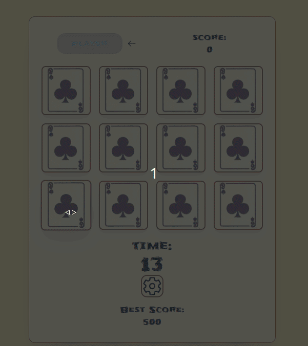
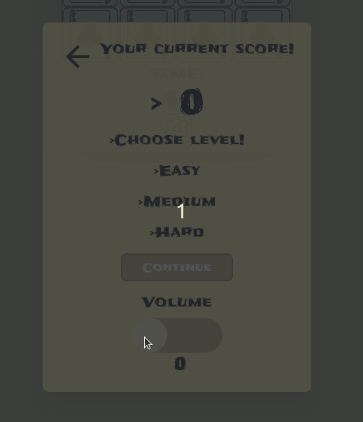

# Memory Game
A fun and challenging memory card matching game built with React.

<div style="text-align: center;">
  
</div>

## About
This is a memory card matching game where players have to flip over cards and match pairs based on their images. 
The game has different difficulty levels and a scoring system based on time and number of moves. It also includes sound 
effects and volume control.
## How to Play
- Choose a difficulty level (easy, medium, or hard).
- Flip over cards and try to match pairs of cards with the same image.
- Keep track of your score as you progress.
- When all pairs are matched, your score will be shown, and you can choose to play again.
## Features
- Multiple difficulty levels (easy, medium, hard)
- Real-time scoring based on time and number of moves
- Sound effects with volume control
- Responsive design for mobile and desktop
- Game reset and best score tracking
## Technologies Used
- React
- JavaScript
- Tailwind CSS
- Jest (for testing)
- HTML5 & CSS3
## Getting Started

### Prerequisites
Make sure you have Node.js and npm installed on your machine.

### Install dependencies
- To install the dependencies, run the following command:

```bash
npm install
```
### Start the project 
- After installation is complete, you can run the project locally by executing:
```bash
npm start
```
- Your app will be available at http://localhost:3000.
## Running Tests

To run the tests for this project, simply use the following command:

```bash
npm test
```
## Contributing
1. Fork the repository.
2. Create your branch (`git checkout -b feature-branch`).
3. Commit your changes (`git commit -am 'Add new feature'`).
4. Push to the branch (`git push origin feature-branch`).
5. Create a new Pull Request.
## Resources
- [React Documentation](https://reactjs.org/docs/getting-started.html)
- [Tailwind CSS Documentation](https://tailwindcss.com/docs)
- [Jest Documentation](https://jestjs.io/docs/en/getting-started)
## License
This project is licensed under the MIT License - see the [LICENSE](LICENSE) file for details.
## Changelog
- Updating the feature of volume level.
<div style="text-align: center;">
  
</div>

## Version
<p class="text-sm">Current version: 1.0.0</p>